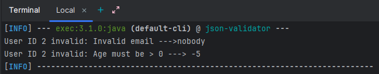

The "JSON Validator" Script

1. Project Title & Goal:

Simple Java-based script that validates user profiles in users.json by checking if the email contains "@" and "." and ensuring the age is greater than 0.

2. Setup Instructions:

Open the terminal and execute the following commands in order from the project root:

mvn clean install

mvn exec:java

3. The Logic:

- I used Java+Jackson approach . I chose this approach because using jackson we can par a json file locally without the help of any external apis.
- I created a User pojo to map each entry of our json file.
- Applied validation checking for a valid email (containing "@") and a valid age (>0).

Hardest Bug and how I fixed it: 

- I encountered an error: Unknown lifecycle phase and later resolved it by adding a dependency in pom.xml that enabled maven to execute my JsonValidator (main) class .

4. Output Screenshots:

5. Future Improvements:

- Add unit tests .
- Add JSON schema validation .
